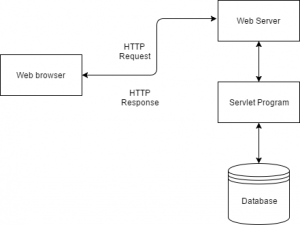

# Spring-Mvc

 

**Servlet** 

> **Servlets** are the Java **programs(class)** that run on the Java-enabled web server or application server. They are
> used to handle the request obtained from the webserver, process the request, produce the response, then send a response
> back to the webserver.
>
> 

 

**DispatcherServlet** 

> In **Spring MVC**, all incoming requests go through a **single servlet**. This **servlet - DispatcherServlet** - is
> the front controller. **Front controller** is a typical design pattern in the web applications development. In this
> case, a single servlet receives all requests and transfers them to all other components of the application.

> The task of the **DispatcherServlet** is to send request to the specific **Spring MVC** controller.

 

